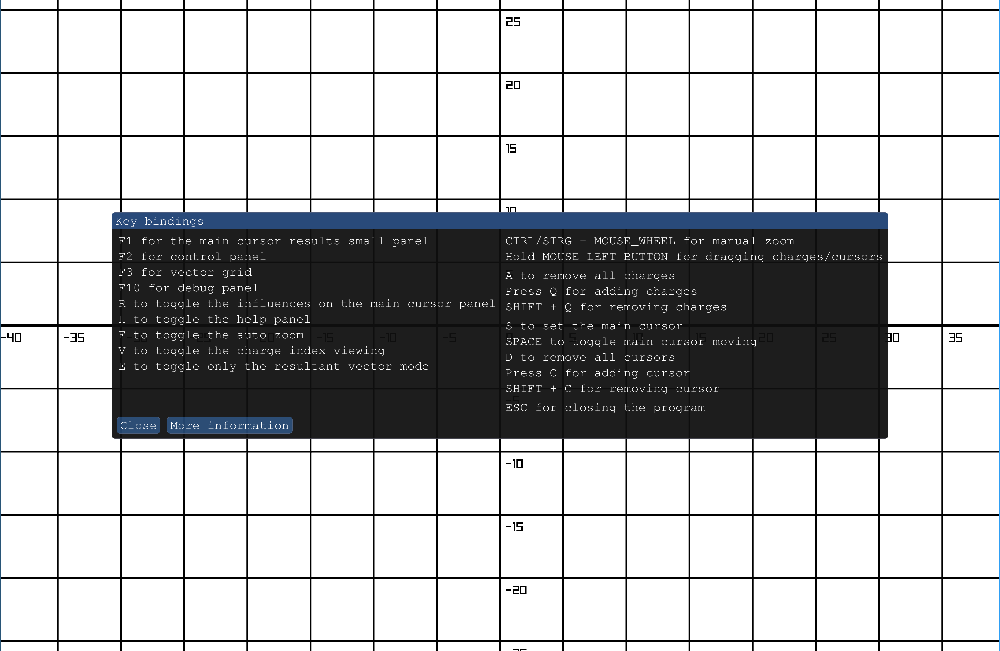
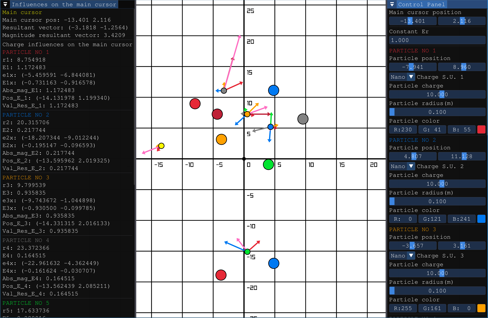
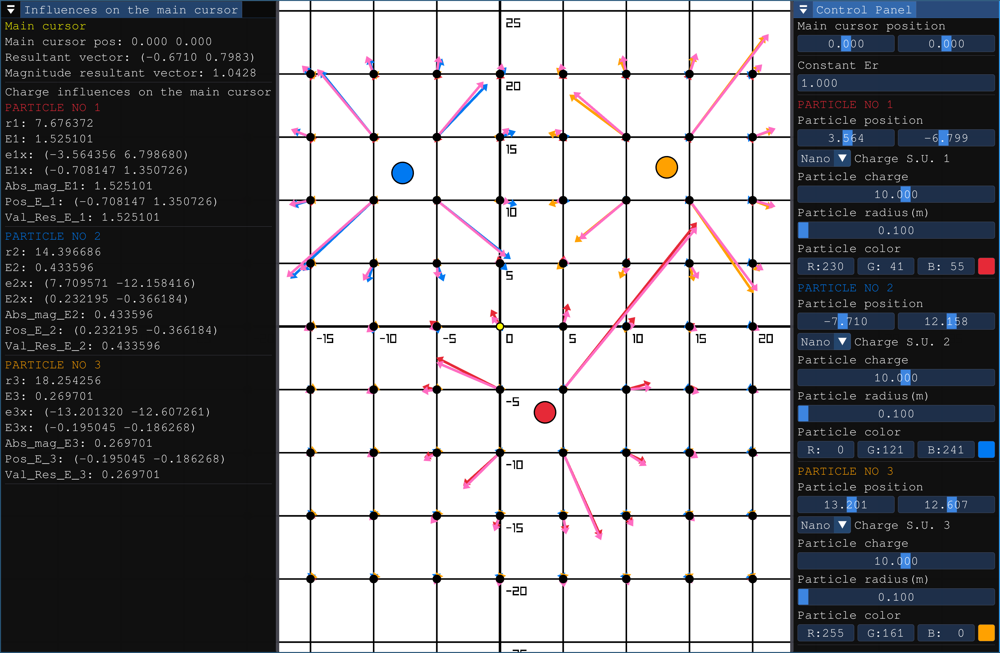

This side project, developed over the course of a few weeks in my spare time, began as a surprise for one of my university professors. Inspired by a simulator he had created in Excel, I used it as a foundation and built an enhanced, more capable version. The project uses raylib for rendering and an ImGui-based interface to provide an interactive and visually engaging experience.

Tested also on windows, linux (Raspberry pi 4)

  
  
  

